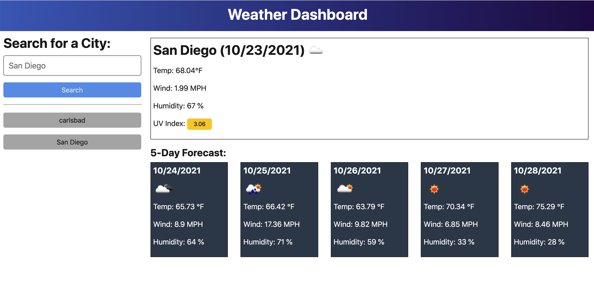

# weather-app
* One of the questions most commonly asked is "what is the weather going to be like today?" With that in mind, as a developer, I created a weather app that allows users to search a specific city and the app will return a 5-day forecast for that city. Additionally, the app will log previously saved searches for a quick reference.

## About the Project
The application allows the user to input a search term. This application utilizes a weather geo location API and a weather API to cross-reference the user's search and return a 5-day weather forecast for the searched city.

## Screenshot
Attached is the pathway to a screenshot of the web application:

## Getting Started

Enter the following link into your browser to use this application:
https://vbmisra.github.io/weather-app/

To view the applications code, visit the GitHub repository here:
https://github.com/vbmisra/weather-app
